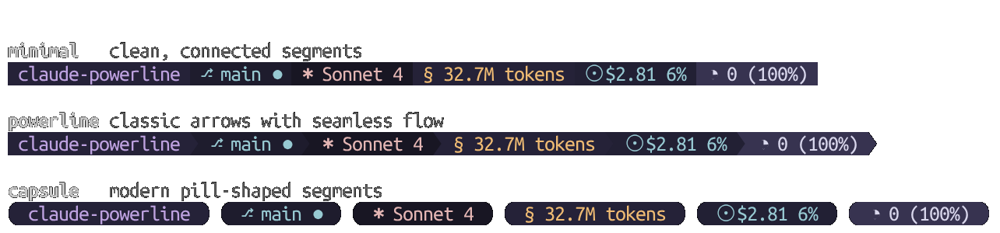

<div align="center">

# Claude Powerline

**A vim-style powerline statusline for Claude Code with real-time usage tracking, git integration, and custom themes.**


[](https://www.npmjs.com/package/@owloops/claude-powerline)
[](https://www.npmjs.com/package/@owloops/claude-powerline)
[](https://packagephobia.com/result?p=@owloops/claude-powerline)
[](https://www.npmjs.com/package/@owloops/claude-powerline)

[](https://github.com/hesreallyhim/awesome-claude-code)

### Demo


_Live demonstration: real-time usage tracking, git integration, and theme showcase_

<table>
   <tr>
      <td align="center">
         <br>
         <strong>Dark</strong>
      </td>
      <td align="center">
         <br>
         <strong>Light</strong>
      </td>
   </tr>
   <tr>
      <td align="center">
         <br>
         <strong>Nord</strong>
      </td>
      <td align="center">
         <br>
         <strong>Tokyo Night</strong>
      </td>
   </tr>
   <tr>
      <td align="center">
         <br>
         <strong>Rose Pine</strong>
      </td>
      <td align="center">
         <br>
         <em>Create your own!</em>
      </td>
   </tr>
</table>
</div>

## Features

<table>
<tr>
<td width="50%">

**Real-time usage tracking**

Monitor session costs, 5-hour billing windows, and daily budgets with percentage alerts.

</td>
<td width="50%">

**Git integration**

Branch status, commits ahead/behind, working tree changes, and repository info at a glance.

</td>
</tr>
<tr>
<td width="50%">

**6 built-in themes**

Dark, light, nord, tokyo-night, rose-pine, and gruvbox themes with full custom color support.

</td>
<td width="50%">

**Multiple styles**

Minimal, powerline, and capsule separators with unicode or ASCII character sets.

</td>
</tr>
<tr>
<td width="50%">

**Auto-wrap layout**

Segments automatically wrap to new lines based on terminal width. No more cutoff.

</td>
<td width="50%">

**Zero dependencies**

Lightweight and fast with no external dependencies to install.

</td>
</tr>
</table>

## Installation

### Setup

Requires Node.js 18+, Claude Code, and Git 2.0+. For best display, install a [Nerd Font](https://www.nerdfonts.com/) or use `--charset=text` for ASCII-only symbols.

**1. Add to your Claude Code `settings.json`:**

```json
{
  "statusLine": {
    "type": "command",
    "command": "npx -y @owloops/claude-powerline@latest --style=powerline"
  }
}
```

**2. Start a Claude session** - the statusline appears at the bottom during conversations.


Using `npx` automatically downloads and runs the latest version without manual updates.

## Usage

Once added to Claude Code settings, the statusline runs automatically. For customization:

**CLI Options** (both `--arg value` and `--arg=value` syntax supported):

- `--theme` - `dark` (default), `light`, `nord`, `tokyo-night`, `rose-pine`, `gruvbox`, `custom`
- `--style` - `minimal` (default), `powerline`, `capsule`
- `--charset` - `unicode` (default), `text`
- `--config` - Custom config file path
- `--help` - Show help

**Examples:**

```bash
claude-powerline --theme=nord --style=powerline
claude-powerline --theme=dark --style=capsule --charset=text
claude-powerline --config=/path/to/config.json
```

**Environment Variables:**

```bash
export CLAUDE_POWERLINE_THEME=dark
export CLAUDE_POWERLINE_STYLE=powerline
export CLAUDE_POWERLINE_CONFIG=/path/to/config.json
export CLAUDE_POWERLINE_DEBUG=1  # Enable debug logging
```

## Styles



## Configuration

**Get example config:**

```bash
# Download full-featured example config
curl -o ~/.claude/claude-powerline.json https://raw.githubusercontent.com/Owloops/claude-powerline/main/.claude-powerline.json
```

**Config locations** (in priority order):

- `./.claude-powerline.json` - Project-specific
- `~/.claude/claude-powerline.json` - User config
- `~/.config/claude-powerline/config.json` - XDG standard

**Override priority:** CLI flags → Environment variables → Config files → Defaults

Config files reload automatically and no restart needed.

### Segment Configuration

<details>
<summary><strong>Directory</strong> - Shows current working directory name</summary>

```json
"directory": {
  "enabled": true,
  "style": "full"
}
```

**Options:**

- `style`: Display format - `full` | `fish` | `basename`
  - `full`: Show complete path (e.g., `~/projects/claude-powerline`)
  - `fish`: Fish-shell style abbreviation (e.g., `~/p/claude-powerline`)
  - `basename`: Show only folder name (e.g., `claude-powerline`)

</details>

<details>
<summary><strong>Git</strong> - Shows branch, status, and repository information</summary>

```json
"git": {
  "enabled": true,
  "showSha": true,
  "showWorkingTree": false,
  "showOperation": false,
  "showTag": false,
  "showTimeSinceCommit": false,
  "showStashCount": false,
  "showUpstream": false,
  "showRepoName": false
}
```

**Options:**

- `showSha`: Show abbreviated commit SHA
- `showWorkingTree`: Show staged/unstaged/untracked counts
- `showOperation`: Show ongoing operations (MERGE/REBASE/CHERRY-PICK)
- `showTag`: Show nearest tag
- `showTimeSinceCommit`: Show time since last commit
- `showStashCount`: Show stash count
- `showUpstream`: Show upstream branch
- `showRepoName`: Show repository name

**Symbols:**

- Unicode: `⎇` Branch • `♯` SHA • `⌂` Tag • `⧇` Stash • `✓` Clean • `●` Dirty • `⚠` Conflicts • `↑3` Ahead • `↓2` Behind • `(+1 ~2 ?3)` Staged/Unstaged/Untracked
- Text: `~` Branch • `#` SHA • `T` Tag • `S` Stash • `=` Clean • `*` Dirty • `!` Conflicts • `^3` Ahead • `v2` Behind • `(+1 ~2 ?3)` Staged/Unstaged/Untracked

</details>

<details>
<summary><strong>Metrics</strong> - Shows performance analytics from your Claude sessions</summary>

```json
"metrics": {
  "enabled": true,
  "showResponseTime": true,
  "showLastResponseTime": false,
  "showDuration": true,
  "showMessageCount": true,
  "showLinesAdded": true,
  "showLinesRemoved": true
}
```

**Options:**

- `showResponseTime`: Total API duration across all requests
- `showLastResponseTime`: Individual response time for most recent query
- `showDuration`: Total session duration
- `showMessageCount`: Number of user messages sent
- `showLinesAdded`: Lines of code added during session
- `showLinesRemoved`: Lines of code removed during session

**Symbols:**

- Unicode: `⧖` Total API time • `Δ` Last response • `⧗` Session duration • `⟐` Messages • `+` Lines added • `-` Lines removed
- Text: `R` Total API time • `L` Last response • `T` Session duration • `#` Messages • `+` Lines added • `-` Lines removed

</details>

<details>
<summary><strong>Model</strong> - Shows current Claude model being used</summary>

```json
"model": {
  "enabled": true
}
```

**Symbols:** `✱` Model (unicode) • `M` Model (text)

</details>

<details>
<summary><strong>Context</strong> - Shows context window usage and auto-compact threshold</summary>

```json
"context": {
  "enabled": true,
  "showPercentageOnly": false,
  "displayStyle": "text"
}
```

**Options:**

- `showPercentageOnly`: Show only percentage remaining (default: false)
- `displayStyle`: Visual style for context display (default: `"text"`)

**Display Styles:**

| Style | Example | Description |
|-------|---------|-------------|
| `text` | `◔ 34,040 (79%)` | Text with token count (default) |
| `bar` | `▪▪▪▪▫▫▫▫▫▫ 40%` | Bar using theme symbols |
| `blocks` | `████░░░░░░ 40%` | Solid/shaded blocks |
| `squares` | `◼◼◼◼◻◻◻◻◻◻ 40%` | Filled/empty squares |
| `dots` | `●●●●○○○○○○ 40%` | Filled/empty circles |
| `line` | `━━━━┄┄┄┄┄┄ 40%` | Thick/dashed line |
| `capped` | `━━━╸┄┄┄┄┄┄ 40%` | Line with boundary cap |
| `ball` | `───●────── 40%` | Position marker on a track |
| `filled` | `■■■■□□□□□□ 40%` | Filled/empty squares (alt) |
| `geometric` | `▰▰▰▰▱▱▱▱▱▱ 40%` | Geometric triangles |

**Symbols:** `◔` Context (unicode) • `C` Context (text)

##### Model Context Limits

Configure context window limits for different model types. Defaults to 200K tokens for all models.

```json
"modelContextLimits": {
  "sonnet": 1000000,
  "opus": 200000
}
```

**Available Model Types:**

- `sonnet`: Claude Sonnet models (3.5, 4, etc.)
- `opus`: Claude Opus models
- `default`: Fallback for unrecognized models (200K)

**Note:** Sonnet 4's 1M context window is currently in beta for tier 4+ users. Set `"sonnet": 1000000` when you have access.

</details>

<details>
<summary><strong>Tmux</strong> - Shows tmux session name and window info when in tmux</summary>

```json
"tmux": {
  "enabled": true
}
```

**Display:** `tmux:session-name`

</details>

<details>
<summary><strong>Version</strong> - Shows Claude Code version</summary>

```json
"version": {
  "enabled": true
}
```

**Display:** `v1.0.81`

**Symbols:** `◈` Version (unicode) • `V` Version (text)

</details>

<details>
<summary><strong>Session</strong> - Shows real-time usage for current Claude conversation</summary>

```json
"session": {
  "enabled": true,
  "type": "tokens",
  "costSource": "calculated"
}
```

**Options:**

- `type`: Display format - `cost` | `tokens` | `both` | `breakdown`
- `costSource`: Cost calculation method - `calculated` (ccusage-style) | `official` (hook data)

**Symbols:** `§` Session (unicode) • `S` Session (text)

</details>

<details>
<summary><strong>Block</strong> - Shows usage within current 5-hour billing window (Claude's rate limit period)</summary>

```json
"block": {
  "enabled": true,
  "type": "weighted",
  "burnType": "cost"
}
```

**Options:**

- `type`: Display format - `cost` | `tokens` | `both` | `time` | `weighted`
- `burnType`: Burn rate display - `cost` | `tokens` | `both` | `none`

**Weighted Tokens:** Opus tokens count 5x toward rate limits compared to Sonnet/Haiku tokens

**Symbols:** `◱` Block (unicode) • `B` Block (text)

</details>

<details>
<summary><strong>Today</strong> - Shows total daily usage with budget monitoring</summary>

```json
"today": {
  "enabled": true,
  "type": "cost"
}
```

**Options:**

- `type`: Display format - `cost` | `tokens` | `both` | `breakdown`

**Symbols:** `☉` Today (unicode) • `D` Today (text)

</details>

<details>
<summary><strong>Session Summary</strong> - Shows current session's name, summary, or first user prompt</summary>

```json
"session-summary": {
  "enabled": true,
  "showIcon": false,
  "maxLength": 50,
  "separateLine": true
}
```

**Options:**

- `showIcon`: Show the 💬 icon prefix (default: true)
- `maxLength`: Truncate text to this length with ellipsis (default: unlimited)
- `separateLine`: Always render on its own line below the main powerline (default: false)

**Display:** `💬 Add session summary segment` or `Add session summary segment` (no icon)

**Symbols:** `💬` Session summary (unicode) • `N` Session summary (text)

**Resolution order:** The segment resolves the session name using the first available source:

1. **Custom title** — name set via `/rename` command
2. **Summary** — auto-generated summary from `sessions-index.json`
3. **First prompt** — `firstPrompt` field from `sessions-index.json`
4. **Transcript fallback** — first user message from the session transcript file

System-injected content (command caveats, system reminders) is automatically filtered out.

</details>

### Budget Configuration

```json
"budget": {
  "session": { "amount": 10.0, "warningThreshold": 80 },
  "today": { "amount": 25.0, "warningThreshold": 80 },
  "block": { "amount": 15.0, "type": "cost", "warningThreshold": 80 }
}
```

**Options:**

- `amount`: Budget limit (required for percentage display)
- `type`: Budget type - `cost` (USD) | `tokens` (for token-based limits)
- `warningThreshold`: Warning threshold percentage (default: 80)

**Indicators:** `25%` Normal • `+75%` Moderate (50-79%) • `!85%` Warning (80%+)

> [!TIP]
> Claude's rate limits consider multiple factors beyond tokens (message count, length, attachments, model). See [Anthropic's usage documentation](https://support.anthropic.com/en/articles/11014257-about-claude-s-max-plan-usage) for details.

### Character Sets

Choose between Unicode symbols (requires Nerd Font) or ASCII text mode for maximum compatibility.

```json
{
  "display": {
    "charset": "unicode"
  }
}
```

**Options:**

- `unicode` (default) - Uses Nerd Font icons and symbols (⎇, ✱, ●, ↑, ↓, etc.)
- `text` - ASCII-only characters (~, M, *, ^, v, etc.) for terminals without Nerd Font

**Combinations with styles:**

The charset setting works independently from separator styles, giving you 6 possible combinations:
- `minimal` + `unicode` / `text` - No separators
- `powerline` + `unicode` / `text` - Arrow separators (requires Nerd Font for unicode)
- `capsule` + `unicode` / `text` - Rounded caps (requires Nerd Font for unicode)

**CLI Usage:**

```bash
claude-powerline --charset=text --style=minimal
claude-powerline --charset=unicode --style=powerline
```

### Auto-Wrap

Automatically wrap segments to new lines based on terminal width.

```json
{
  "display": {
    "autoWrap": true
  }
}
```

Segments flow naturally and wrap to new lines when they exceed the terminal width. The layout adjusts automatically when the terminal is resized. Enabled by default.

### Multi-line Layout

Alternatively, manually organize segments across multiple lines.

```json
{
  "display": {
    "lines": [
      {
        "segments": {
          "directory": { "enabled": true },
          "git": { "enabled": true },
          "model": { "enabled": true }
        }
      },
      {
        "segments": {
          "session": { "enabled": true },
          "today": { "enabled": true },
          "context": { "enabled": true }
        }
      }
    ]
  }
}
```

> [!NOTE]
> Claude Code system messages may truncate long status lines. Use `autoWrap` or manual multi-line layouts to prevent segment cutoff.

### Padding

Control the spacing inside each segment.

```json
{
  "display": {
    "padding": 1
  }
}
```

The value is the number of spaces on each side of the text. Set to `0` for a compact look, `1` (default) for standard spacing, or higher for more breathing room.

### Colors & Themes

Create custom themes and configure color compatibility:

```json
{
  "theme": "custom",
  "display": {
    "colorCompatibility": "auto"
  },
  "colors": {
    "custom": {
      "directory": { "bg": "#ff6600", "fg": "#ffffff" },
      "git": { "bg": "#0066cc", "fg": "#ffffff" },
      "session": { "bg": "#cc0099", "fg": "#ffffff" }
    }
  }
}
```

**Color Options:** `bg` (hex, `transparent`, `none`) • `fg` (hex)

**Compatibility Modes:** `auto` (default), `ansi`, `ansi256`, `truecolor`

**Environment Variables:**

- `NO_COLOR` - Disable all colors when set to any non-empty value (follows [NO_COLOR standard](https://no-color.org/))
- `FORCE_COLOR` - Force enable color output (follows [FORCE_COLOR standard](https://force-color.org/)):
  - `0` or `false` - Disable colors
  - `1` or `true` - Force basic 16 colors (ANSI)
  - `2` - Force 256 colors
  - `3` - Force truecolor (16 million colors)
  - Any other non-empty value - Force basic colors
- `COLORTERM` - Auto-detected for truecolor support

**Priority:** `FORCE_COLOR` overrides `NO_COLOR` (allowing color to be forced on even when NO_COLOR is set)

## Performance

Execution times for different configurations:

- **~80ms** default config (`directory`, `git`, `model`, `session`, `today`, `context`)
- **~240ms** full-featured (all segments enabled)

<details>
<summary><strong>Detailed Segment Timings</strong></summary>

| Segment     | Timing | Notes                                      |
| ----------- | ------ | ------------------------------------------ |
| `directory` | ~40ms  | No external commands                       |
| `model`     | ~40ms  | Uses hook data                             |
| `session`   | ~40ms  | Minimal transcript parsing                 |
| `context`   | ~40ms  | Hook data calculation                      |
| `metrics`   | ~40ms  | Transcript analysis                        |
| `git`       | ~60ms  | No caching for fresh data                  |
| `tmux`      | ~50ms  | Environment check + command                |
| `block`     | ~180ms | 5-hour window transcript load              |
| `today`     | ~250ms | Full daily transcript load (cached: ~50ms) |
| `version`   | ~40ms  | Uses hook data                             |

**Benchmark:** `npm run benchmark:timing`

</details>

### Optimization Tips

- **Global install:** `npm install -g` to avoid npx overhead
- **Disable unused segments** for faster execution
- **Cache cleanup:** Remove `~/.claude/powerline/` if needed

## Custom Segments

Extend the statusline using shell composition:

```json
{
  "statusLine": {
    "type": "command",
    "command": "npx -y @owloops/claude-powerline && echo \" $(date +%H:%M)\"",
    "padding": 0
  }
}
```

> [!NOTE]  
> Use `tput` for colors: `setab <bg>` (background), `setaf <fg>` (foreground), `sgr0` (reset). Example: `echo "$(tput setab 4)$(tput setaf 15) text $(tput sgr0)"`. For complex logic, create a shell script with multiple commands, conditions, and variables.

## Contributing

Contributions are welcome! Please feel free to submit issues or pull requests.

See [CONTRIBUTORS.md](CONTRIBUTORS.md) for people who have contributed outside of GitHub PRs.

## License

This project is licensed under the [MIT License](LICENSE).
