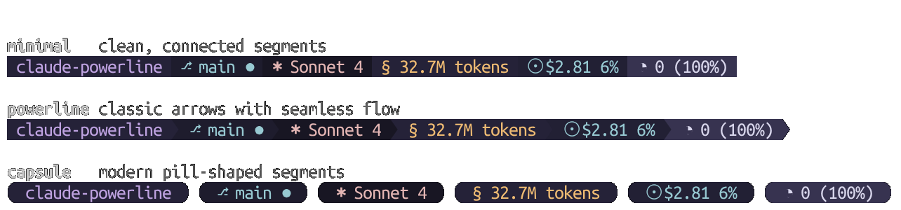

<div align="center">

# Claude Powerline

**A vim-style powerline statusline for Claude Code with real-time usage tracking, git integration, and custom themes.**


[](https://www.npmjs.com/package/@owloops/claude-powerline)
[](https://www.npmjs.com/package/@owloops/claude-powerline)
[](https://packagephobia.com/result?p=@owloops/claude-powerline)
[](https://www.npmjs.com/package/@owloops/claude-powerline)

[](https://github.com/hesreallyhim/awesome-claude-code)


</div>

## Installation

Requires Node.js 18+, Claude Code, and Git 2.0+. For best display, install a [Nerd Font](https://www.nerdfonts.com/) or use `--charset=text` for ASCII-only symbols.

### Setup Wizard (Recommended)

The interactive wizard walks you through theme, style, font, segment, and budget selection.

```bash
# run inside Claude Code, one at a time
/plugin marketplace add Owloops/claude-powerline
/plugin install claude-powerline@claude-powerline
/powerline
```

The wizard writes `~/.claude/claude-powerline.json` and updates your `settings.json` automatically. Run `/powerline` again any time to reconfigure.

### Manual Setup

Add to your Claude Code `settings.json`:

```json
{
  "statusLine": {
    "type": "command",
    "command": "npx -y @owloops/claude-powerline@latest --style=powerline"
  }
}
```

Start a Claude session and the statusline appears at the bottom. Using `npx` automatically downloads and runs the latest version without manual updates.

## Powerline Studio

<a href="https://powerline.owloops.com/">
  
</a>

[**powerline.owloops.com**](https://powerline.owloops.com/) is a visual configurator for claude-powerline. Click segments in the preview to toggle options, switch styles and themes live, reorder, then copy or download the JSON into `~/.claude/claude-powerline.json`. Paste an existing config to edit it.

<details>
<summary><strong>Styles</strong></summary>



</details>

<details>
<summary><strong>Themes</strong></summary>


6 built-in themes (dark, light, nord, tokyo-night, rose-pine, gruvbox) or [create your own](#configuration).

</details>

<details>
<summary><h2>Configuration</h2></summary>

**Config locations** (in priority order):

- `./.claude-powerline.json` - Project-specific
- `~/.claude/claude-powerline.json` - User config
- `~/.config/claude-powerline/config.json` - XDG standard

**Override priority:** CLI flags > Environment variables > Config files > Defaults

Config files reload automatically, no restart needed.

**Get example config:**

```bash
curl -o ~/.claude/claude-powerline.json https://raw.githubusercontent.com/Owloops/claude-powerline/main/.claude-powerline.json
```

<details>
<summary><strong>CLI Options and Environment Variables</strong></summary>

**CLI Options** (both `--arg value` and `--arg=value` syntax supported):

- `--theme` - `dark` (default), `light`, `nord`, `tokyo-night`, `rose-pine`, `gruvbox`, `custom`
- `--style` - `minimal` (default), `powerline`, `capsule`, `tui`
- `--charset` - `unicode` (default), `text`
- `--config` - Custom config file path
- `--help` - Show help

**Examples:**

```bash
claude-powerline --theme=nord --style=powerline
claude-powerline --theme=dark --style=capsule --charset=text
claude-powerline --config=/path/to/config.json
```

**Environment Variables:**

```bash
export CLAUDE_POWERLINE_THEME=dark
export CLAUDE_POWERLINE_STYLE=powerline
export CLAUDE_POWERLINE_CONFIG=/path/to/config.json
export CLAUDE_POWERLINE_DEBUG=1  # Enable debug logging
```

</details>

### Segment Configuration

<details>
<summary><strong>Directory</strong> - Shows current working directory name</summary>

```json
"directory": {
  "enabled": true,
  "style": "full"
}
```

**Options:**

- `style`: Display format - `full` | `fish` | `basename`
  - `full`: Show complete path (e.g., `~/projects/claude-powerline`)
  - `fish`: Fish-shell style abbreviation (e.g., `~/p/claude-powerline`)
  - `basename`: Show only folder name (e.g., `claude-powerline`)

In `--worktree` sessions, the directory segment automatically shows the original repo path instead of the worktree folder (no config required).

</details>

<details>
<summary><strong>Git</strong> - Shows branch, status, and repository information</summary>

```json
"git": {
  "enabled": true,
  "showSha": true,
  "showWorkingTree": false,
  "showOperation": false,
  "showTag": false,
  "showTimeSinceCommit": false,
  "showStashCount": false,
  "showUpstream": false,
  "showRepoName": false
}
```

**Options:**

- `showSha`: Show abbreviated commit SHA
- `showWorkingTree`: Show staged/unstaged/untracked counts
- `showOperation`: Show ongoing operations (MERGE/REBASE/CHERRY-PICK)
- `showTag`: Show nearest tag
- `showTimeSinceCommit`: Show time since last commit
- `showStashCount`: Show stash count
- `showUpstream`: Show upstream branch
- `showRepoName`: Show repository name

**Symbols:**

- Unicode: `⎇` Branch &#8226; `♯` SHA &#8226; `⌂` Tag &#8226; `⧇` Stash &#8226; `✓` Clean &#8226; `●` Dirty &#8226; `⚠` Conflicts &#8226; `↑3` Ahead &#8226; `↓2` Behind &#8226; `(+1 ~2 ?3)` Staged/Unstaged/Untracked
- Text: `~` Branch &#8226; `#` SHA &#8226; `T` Tag &#8226; `S` Stash &#8226; `=` Clean &#8226; `*` Dirty &#8226; `!` Conflicts &#8226; `^3` Ahead &#8226; `v2` Behind &#8226; `(+1 ~2 ?3)` Staged/Unstaged/Untracked

</details>

<details>
<summary><strong>Model</strong> - Shows current Claude model being used</summary>

```json
"model": {
  "enabled": true
}
```

**Symbols:** `✱` Model (unicode) &#8226; `M` Model (text)

</details>

<details>
<summary><strong>Session</strong> - Shows real-time usage for current Claude conversation</summary>

```json
"session": {
  "enabled": true,
  "type": "tokens",
  "costSource": "calculated"
}
```

**Options:**

- `type`: Display format - `cost` | `tokens` | `both` | `breakdown`
- `costSource`: Cost calculation method - `calculated` (ccusage-style) | `official` (hook data)

**Symbols:** `§` Session (unicode) &#8226; `S` Session (text)

</details>

<details>
<summary><strong>Today</strong> - Shows total daily usage with budget monitoring</summary>

```json
"today": {
  "enabled": true,
  "type": "cost"
}
```

**Options:**

- `type`: Display format - `cost` | `tokens` | `both` | `breakdown`

**Symbols:** `☉` Today (unicode) &#8226; `D` Today (text)

</details>

<details>
<summary><strong>Context</strong> - Shows context window usage and auto-compact threshold</summary>

```json
"context": {
  "enabled": true,
  "showPercentageOnly": false,
  "displayStyle": "text",
  "autocompactBuffer": 33000
}
```

**Options:**

- `showPercentageOnly`: Show only percentage remaining (default: false)
- `displayStyle`: Visual style for context display (default: `"text"`)
- `autocompactBuffer`: Number of tokens reserved as the auto-compact trigger zone (default: `33000`). The usable percentage reflects how close you are to the point where compaction fires. Set to `0` if you have auto-compact disabled to show raw context usage instead
- `percentageMode`: How to display the percentage. `"remaining"` counts down from 100% (context left), `"used"` counts up from 0% (context consumed). Default depends on display style: `"remaining"` for `text`, `"used"` for bar styles

**Display Styles:**

| Style | Filled | Empty | Example |
|-------|--------|-------|---------|
| `text` | -- | -- | `◔ 34,040 (79%)` |
| `ball` | ─ | ─ | `─────●──── 50%` |
| `bar` | ▓ | ░ | `▓▓▓▓▓░░░░░ 50%` |
| `blocks` | █ | ░ | `█████░░░░░ 50%` |
| `blocks-line` | █ | ─ | `█████───── 50%` |
| `capped` | ━ | ┄ | `━━━━╸┄┄┄┄┄ 50%` |
| `dots` | ● | ○ | `●●●●●○○○○○ 50%` |
| `filled` | ■ | □ | `■■■■■□□□□□ 50%` |
| `geometric` | ▰ | ▱ | `▰▰▰▰▰▱▱▱▱▱ 50%` |
| `line` | ━ | ┄ | `━━━━━┄┄┄┄┄ 50%` |
| `squares` | ◼ | ◻ | `◼◼◼◼◼◻◻◻◻◻ 50%` |

**Symbols:** `◔` Context (unicode) &#8226; `C` Context (text)

#### Model Context Limits

Configure context window limits for different model types. Defaults to 200K tokens for all models.

```json
"modelContextLimits": {
  "sonnet": 1000000,
  "opus": 200000
}
```

**Available Model Types:**

- `sonnet`: Claude Sonnet models (3.5, 4, etc.)
- `opus`: Claude Opus models
- `default`: Fallback for unrecognized models (200K)

**Note:** Sonnet 4's 1M context window is currently in beta for tier 4+ users. Set `"sonnet": 1000000` when you have access.

</details>

<details>
<summary><strong>Block</strong> - Shows usage within current 5-hour billing window (Claude's rate limit period)</summary>

```json
"block": {
  "enabled": true,
  "displayStyle": "text"
}
```

**Options:**

- `displayStyle`: Visual style for utilization display (see table below)

Requires Claude Code's native `rate_limits` hook data (Claude.ai Pro/Max subscribers). Displays the official 5-hour utilization percentage and reset countdown. Hidden when native data is unavailable.

**Display Styles:**

| Style | Example |
|-------|---------|
| `text` (default) | `◱ 23% (4h 12m)` |
| `bar` | `◱ ▪▪▫▫▫▫▫▫▫▫ 23% (4h 12m)` |
| `blocks` | `◱ ██░░░░░░░░ 23% (4h 12m)` |
| `blocks-line` | `◱ ██──────── 23% (4h 12m)` |
| `capped` | `◱ ━╸┄┄┄┄┄┄┄┄ 23% (4h 12m)` |
| `dots` | `◱ ●●○○○○○○○○ 23% (4h 12m)` |
| `filled` | `◱ ■■□□□□□□□□ 23% (4h 12m)` |
| `geometric` | `◱ ▰▰▱▱▱▱▱▱▱▱ 23% (4h 12m)` |
| `line` | `◱ ━━┄┄┄┄┄┄┄┄ 23% (4h 12m)` |
| `squares` | `◱ ◼◼◻◻◻◻◻◻◻◻ 23% (4h 12m)` |
| `ball` | `◱ ──●─────── 23% (4h 12m)` |

**Symbols:** `◱` Block (unicode) &#8226; `B` Block (text)

</details>

<details>
<summary><strong>Weekly</strong> - Shows usage within 7-day rolling rate limit window</summary>

```json
"weekly": {
  "enabled": true,
  "displayStyle": "text"
}
```

**Options:**

- `displayStyle`: Visual style for utilization display - same options as the block segment (see table above)

Only visible when Claude Code provides native `rate_limits.seven_day` data (Claude.ai Pro/Max subscribers). Hidden when the data is not available.

**Symbols:** `◑` Weekly (unicode) &#8226; `W` Weekly (text)

</details>

<details>
<summary><strong>Metrics</strong> - Shows performance analytics from your Claude sessions</summary>

```json
"metrics": {
  "enabled": true,
  "showResponseTime": true,
  "showLastResponseTime": false,
  "showDuration": true,
  "showMessageCount": true,
  "showLinesAdded": true,
  "showLinesRemoved": true
}
```

**Options:**

- `showResponseTime`: Total API duration across all requests
- `showLastResponseTime`: Individual response time for most recent query
- `showDuration`: Total session duration
- `showMessageCount`: Number of user messages sent
- `showLinesAdded`: Lines of code added during session
- `showLinesRemoved`: Lines of code removed during session

**Symbols:**

- Unicode: `⧖` Total API time &#8226; `Δ` Last response &#8226; `⧗` Session duration &#8226; `⟐` Messages &#8226; `+` Lines added &#8226; `-` Lines removed
- Text: `R` Total API time &#8226; `L` Last response &#8226; `T` Session duration &#8226; `#` Messages &#8226; `+` Lines added &#8226; `-` Lines removed

</details>

<details>
<summary><strong>Version</strong> - Shows Claude Code version</summary>

```json
"version": {
  "enabled": true
}
```

**Display:** `v1.0.81`

**Symbols:** `◈` Version (unicode) &#8226; `V` Version (text)

</details>

<details>
<summary><strong>Agent</strong> - Shows active subagent name when Claude Code is invoked with <code>--agent</code> (hidden otherwise)</summary>

```json
"agent": {
  "enabled": true,
  "showLabel": false
}
```

**Display:** `◇ researcher` (or `◇ agent: researcher` with `showLabel: true`)

**Symbols:** `◇` Agent (unicode) &#8226; `&` Agent (text)

</details>

<details>
<summary><strong>Thinking</strong> - Shows extended-thinking on/off state and/or reasoning effort level when provided by Claude Code</summary>

```json
"thinking": {
  "enabled": true,
  "showEnabled": true,
  "showEffort": true
}
```

Set `showEnabled: false` to hide the `On`/`Off` state, or `showEffort: false` to hide the effort level. If both are true the two parts are joined with `·`; if only one is shown, no separator is rendered.

**Display:** `✦ On · xhigh` (both shown) &#8226; `✦ On` (enabled only) &#8226; `✦ xhigh` (effort only)

**Symbols:** `✦` Thinking (unicode) &#8226; `T` Thinking (text)

</details>

<details>
<summary><strong>Cache Timer</strong> - Shows time since last turn, tracking Claude's 5-minute prompt cache TTL</summary>

Opt-in (`enabled: false` by default).

```json
"cacheTimer": {
  "enabled": true
}
```

**Display:** `◴ 3:42` (m:ss under 5m) &#8226; `◴ 17m` (5–59m) &#8226; `◴ 1h+` (1 hour or more)

**Color tiers:** healthy green (0–3m) → yellow warn (3–5m) → red critical (5m+). Hidden when `transcript_path` is unavailable.

**Anchor:** elapsed time is measured from the last user message in the transcript (matches Anthropic's cache TTL anchor), falling back to the transcript file mtime if JSONL parsing fails.

**TUI:** also available in grid templates via `{cacheTimer}`, `{cacheTimer.icon}`, and `{cacheTimer.value}`.

**Symbols:** `◴` Cache timer (unicode) &#8226; `C!` Cache timer (text)

> **Note:** `cacheTimer` only updates when Claude Code re-runs the statusline. Set `refreshInterval` in your Claude Code `~/.claude/settings.json` `statusLine` block so the elapsed time ticks while you're idle — otherwise the timer freezes between events:
> ```json
> {
>   "statusLine": {
>     "type": "command",
>     "command": "npx -y @owloops/claude-powerline@latest",
>     "refreshInterval": 10
>   }
> }
> ```
> `refreshInterval` is in seconds (min 1). `10` keeps the displayed value within ~10s of reality.

</details>

<details>
<summary><strong>Proxy Budget</strong> - Shows spend vs. budget reported by a Claude proxy (LiteLLM, OpenRouter, etc.)</summary>

When you route Claude Code through a proxy that exposes a key/budget endpoint, this segment displays your spend against the proxy-side budget — useful when the proxy enforces the cap rather than the upstream provider.

Opt-in (`enabled: false` by default).

```json
"proxyBudget": {
  "enabled": true,
  "type": "spent+percentage"
}
```

By default, the segment reads `ANTHROPIC_BASE_URL` and `ANTHROPIC_AUTH_TOKEN` — the same env vars Claude Code already uses to route through a proxy, so for the typical Claude Code + LiteLLM setup nothing else needs to be configured. To use a different env-var pair (for example a separate read-only key, or a non-Claude-Code-routed setup), override `baseUrlEnv` and `tokenEnv`:

```sh
export ANTHROPIC_BASE_URL="https://litellm.example.com"
export ANTHROPIC_AUTH_TOKEN="sk-..."
```

**Options:**

| Option | Default | Description |
|---|---|---|
| `type` | `spent+percentage` | Display format: `spent`, `remaining`, `percentage`, or `spent+percentage`. |
| `endpoint` | `${baseUrl}/key/info` | Path or full URL. `${baseUrl}` is substituted from `baseUrlEnv`. |
| `baseUrlEnv` | `ANTHROPIC_BASE_URL` | Env var holding the proxy base URL. |
| `tokenEnv` | `ANTHROPIC_AUTH_TOKEN` | Env var holding the bearer token (the value never enters the config file). |
| `authScheme` | `bearer` | `bearer` (Authorization header) or `x-api-key`. |
| `spendPath` | `info.spend` | Dotted JSON path to the current spend in the response body. |
| `budgetPath` | `info.max_budget` | Dotted JSON path to the budget cap. |
| `resetAtPath` | `info.budget_reset_at` | Dotted JSON path to the ISO-8601 reset timestamp (used when `showResetTime: true`). |
| `showResetTime` | `false` | Append a relative time like `· 5d` derived from `resetAtPath`. |
| `warningThreshold` | `80` | Percentage at which the segment switches to the warning color tier. |
| `criticalThreshold` | `95` | Percentage at which the segment switches to the critical color tier. |
| `cacheTtlSec` | `60` | Disk-cache TTL in seconds. The same response is reused across renders within the window. |
| `timeoutMs` | `3000` | HTTP timeout. On timeout/non-2xx/parse-error the segment falls back to a stale cache (up to `10× cacheTtlSec` old) and otherwise renders nothing — the status bar never blocks on a flaky proxy. |

**Display:** `⛁ $14.35/$1000.00 (1%)` &#8226; `⛁ 84%` (warning) &#8226; `⛁ 96%` (critical)

**Color tiers:** healthy (segment color) → yellow warn (`warningThreshold`+) → red critical (`criticalThreshold`+), reusing `contextWarning`/`contextCritical` so the visual contract matches `today`/`block`.

**Other proxies:** OpenRouter — set `endpoint` to `${baseUrl}/api/v1/auth/key`, `spendPath` to `data.usage`, `budgetPath` to `data.limit`. Anything that returns `{ spend, budget, ... }` JSON for a bearer or `x-api-key` auth header works the same way.

**Symbols:** `⛁` Proxy budget (unicode) &#8226; `P$` Proxy budget (text)

**Out of scope (v1):** cloud-native cost APIs that don't fit the bearer-token-JSON pattern (AWS Bedrock SigV4 + Cost Explorer, Vertex AI service-account JWT + Cloud Billing, Azure RBAC + Cost Management) need different auth and a multi-call shape. Use this segment for proxies; cloud-native cost reporting is a separate concern.

</details>

<details>
<summary><strong>Tmux</strong> - Shows tmux session name and window info when in tmux</summary>

```json
"tmux": {
  "enabled": true
}
```

**Display:** `tmux:session-name`

</details>

<details>
<summary><strong>Session ID</strong> - Shows the current Claude session identifier</summary>

```json
"sessionId": {
  "enabled": false,
  "showIdLabel": true
}
```

**Options:**

- `showIdLabel`: Show the `⌗` icon prefix before the session ID (default: `true`)

**Display:** `⌗ a1b2c3d4-...`

**Symbols:** `⌗` Session ID (unicode) &#8226; `#` Session ID (text)

</details>

<details>
<summary><strong>Env</strong> - Shows the value of an environment variable</summary>

```json
"env": {
  "enabled": true,
  "variable": "CLAUDE_ACCOUNT",
  "prefix": "Acct"
}
```

**Options:**

- `variable` (required): Environment variable name to read
- `prefix`: Label shown before the value. Defaults to the variable name

Hidden when the variable is unset or empty.

**Symbols:** `⚙` Env (unicode) &#8226; `$` Env (text)

</details>

### Advanced Configuration

<details>
<summary><strong>Budget Configuration</strong></summary>

```json
"budget": {
  "session": { "amount": 10.0, "warningThreshold": 80 },
  "today": { "amount": 25.0, "warningThreshold": 80 },
  "block": { "amount": 15.0, "type": "cost", "warningThreshold": 80 }
}
```

**Options:**

- `amount`: Budget limit (required for percentage display)
- `type`: Budget type - `cost` (USD) | `tokens` (for token-based limits)
- `warningThreshold`: Warning threshold percentage (default: 80)
- `showPercentage`: Show the `N%` suffix (default: `true`)
- `showValue`: Show the base cost/token value (default: `true`)

**Indicators:** `25%` Normal &#8226; `+75%` Moderate (50-79%) &#8226; `!85%` Warning (80%+)

**Display toggles.** For `session` and `today`, you can hide the percentage suffix, the base value, or both:

```json
"budget": {
  "today": { "amount": 50, "showPercentage": false }
}
```

- `showPercentage: false` hides the `N%` suffix while keeping the budget configured (e.g. for warning thresholds).
- `showValue: false` renders only the percentage (e.g. `◱ 15%`).
- Both `false` hides the segment entirely.

A visible effect requires `amount > 0` AND a computable percentage (e.g. when `type: "tokens"`, tokens must be present). Without a budget or a computable percentage, these flags are no-ops and the segment falls back to rendering the base value. `block` accepts the same fields for config symmetry but does not render a budget suffix today, so they have no visible effect there.

> [!TIP]
> Claude's rate limits consider multiple factors beyond tokens (message count, length, attachments, model). See [Anthropic's usage documentation](https://support.anthropic.com/en/articles/11014257-about-claude-s-max-plan-usage) for details.

</details>

<details>
<summary><strong>Character Sets</strong></summary>

Choose between Unicode symbols (requires Nerd Font) or ASCII text mode for maximum compatibility.

```json
{
  "display": {
    "charset": "unicode"
  }
}
```

**Options:**

- `unicode` (default) - Uses Nerd Font icons and symbols
- `text` - ASCII-only characters for terminals without Nerd Font

The charset setting works independently from separator styles, giving you 8 possible combinations:

- `minimal` + `unicode` / `text` - No separators
- `powerline` + `unicode` / `text` - Arrow separators (requires Nerd Font for unicode)
- `capsule` + `unicode` / `text` - Rounded caps (requires Nerd Font for unicode)
- `tui` + `unicode` / `text` - Bordered panel with rounded or ASCII box characters

</details>

<details>
<summary><strong>Layout: Auto-Wrap, Multi-line, and Padding</strong></summary>

**Auto-Wrap** (enabled by default):

```json
{
  "display": {
    "autoWrap": true
  }
}
```

Segments flow naturally and wrap to new lines when they exceed the terminal width.

**Multi-line Layout** for manual control:

```json
{
  "display": {
    "lines": [
      {
        "segments": {
          "directory": { "enabled": true },
          "git": { "enabled": true },
          "model": { "enabled": true }
        }
      },
      {
        "segments": {
          "session": { "enabled": true },
          "today": { "enabled": true },
          "context": { "enabled": true }
        }
      }
    ]
  }
}
```

**Padding** - number of spaces on each side of segment text:

```json
{
  "display": {
    "padding": 1
  }
}
```

Set to `0` for compact, `1` (default) for standard spacing.

**Show Icons** - hide the leading emblem on each segment for a text-only look:

```json
{
  "display": {
    "showIcons": false
  }
}
```

Default `true`. Per-segment override via `showIcon` on any segment (e.g. `"git": { "enabled": true, "showIcon": true }`) takes precedence. Status glyphs (git `● ✓ ⚠`, ahead/behind arrows), powerline separators, and metrics sub-icons are unaffected.

> [!NOTE]
> Claude Code system messages may truncate long status lines. Use `autoWrap` or manual multi-line layouts to prevent segment cutoff.

</details>

<details>
<summary><strong>Colors and Custom Themes</strong></summary>

Create custom themes and configure color compatibility:

```json
{
  "theme": "custom",
  "display": {
    "colorCompatibility": "auto"
  },
  "colors": {
    "custom": {
      "directory": { "bg": "#ff6600", "fg": "#ffffff" },
      "git": { "bg": "#0066cc", "fg": "#ffffff" },
      "session": { "bg": "#cc0099", "fg": "#ffffff" }
    }
  }
}
```

**Color Options:** `bg` (hex, `transparent`, `none`) &#8226; `fg` (hex) &#8226; `bold` (boolean, optional, defaults to `false`)

**TUI Grid Colors:** In TUI grid mode, custom colors also support bare segment names and dot-notation parts as keys. A bare segment key (e.g. `"context"`) sets the default color for the segment and all its parts. A part key (e.g. `"context.bar"`) overrides a specific part:

```json
"colors": {
  "custom": {
    "model": { "fg": "#e0d68a" },
    "context": { "fg": "#7dcfff" },
    "metrics.lastResponse": { "fg": "#bb9af7" }
  }
}
```

**Compatibility Modes:** `auto` (default), `ansi`, `ansi256`, `truecolor`

**Environment Variables:**

- `NO_COLOR` - Disable all colors when set to any non-empty value (follows [NO_COLOR standard](https://no-color.org/))
- `FORCE_COLOR` - Force enable color output (follows [FORCE_COLOR standard](https://force-color.org/)):
  - `0` or `false` - Disable colors
  - `1` or `true` - Force basic 16 colors (ANSI)
  - `2` - Force 256 colors
  - `3` - Force truecolor (16 million colors)
  - Any other non-empty value - Force basic colors
- `COLORTERM` - Auto-detected for truecolor support

**Priority:** `FORCE_COLOR` overrides `NO_COLOR` (allowing color to be forced on even when NO_COLOR is set)

</details>

<details>
<summary><strong>TUI Panel Mode</strong></summary>

```json
{
  "statusLine": {
    "type": "command",
    "command": "npx -y @owloops/claude-powerline@latest --style=tui"
  }
}
```

By default, the TUI panel uses a built-in responsive layout. For full control over what goes where, add a `display.tui` object to your config. This activates the **grid layout engine**, a CSS Grid-inspired system that lets you define rows, columns, spans, and responsive breakpoints.

#### Grid Layout Configuration

Add `display.tui` to your config file to enable the grid engine:

```json
{
  "display": {
    "style": "tui",
    "tui": {
      "fitContent": true,
      "widthReserve": 45,
      "minWidth": 32,
      "maxWidth": 120,
      "padding": { "horizontal": 4 },
      "separator": {
        "column": "  ",
        "divider": "─"
      },
      "box": { ... },
      "title": { ... },
      "footer": { ... },
      "segments": { ... },
      "breakpoints": [ ... ]
    }
  }
}
```

| Property | Type | Default | Description |
|---|---|---|---|
| `fitContent` | `boolean` | `false` | Panel shrinks to fit content instead of filling terminal width |
| `widthReserve` | `number` | `45` | Characters reserved from terminal width (ignored when `fitContent: true`) |
| `minWidth` | `number` | `32` | Minimum panel width |
| `maxWidth` | `number` | `∞` | Maximum panel width |
| `padding.horizontal` | `number` | `0` | Extra horizontal padding in `fitContent` mode |
| `separator.column` | `string` | `"  "` | String placed between columns |
| `separator.divider` | `string` | box char | Character used for `---` divider rows |
| `box` | `object` | -- | Custom box-drawing characters (see below) |
| `title` | `object` | -- | Title bar text configuration (see below) |
| `footer` | `object` | -- | Footer text configuration (see below) |
| `segments` | `object` | -- | Custom segment templates (see below) |
| `breakpoints` | `array` | required | Responsive layout definitions |

#### Breakpoints

Each breakpoint defines a complete layout that activates when the panel width is at or above its `minWidth`. The engine picks the first match, sorted widest-first.

```json
"breakpoints": [
  {
    "minWidth": 80,
    "areas": [
      "git.head      git.head     git.head     .               git.working",
      "---",
      "context.icon  context.bar  context.bar  context.pct     context.tokens",
      "block.icon    block.bar    block.bar    block.value     block.time"
    ],
    "columns": ["auto", "1fr", "auto", "auto", "auto"],
    "align": ["left", "left", "right", "right", "right"]
  },
  {
    "minWidth": 55,
    "areas": [
      "git.head             git.working",
      "---",
      "context.bar          context.tokens",
      "block                ."
    ],
    "columns": ["1fr", "auto"],
    "align": ["left", "right"]
  },
  {
    "minWidth": 0,
    "areas": [
      "git.head",
      "git.working",
      "---",
      "context",
      "block"
    ],
    "columns": ["1fr"],
    "align": ["left"]
  }
]
```

| Property | Type | Required | Description |
|---|---|---|---|
| `minWidth` | `number` | yes | Minimum panel width to activate this layout |
| `areas` | `string[]` | yes | Grid rows, each string is one row of space-separated cell names |
| `columns` | `string[]` | yes | Column sizing: `"auto"`, `"1fr"` / `"2fr"`, or a fixed number like `"20"` |
| `align` | `string[]` | no | Per-column alignment: `"left"`, `"center"`, or `"right"` (defaults to `"left"`) |

**Column sizing:**
- `"auto"` - shrinks to the widest content in that column
- `"1fr"`, `"2fr"` - fractional units that divide remaining space proportionally
- `"20"` - fixed width in characters

**Special area tokens:**
- `.` - empty cell (renders as blank space)
- `---` - full-width horizontal divider row

**Spanning:** repeat the same name in adjacent cells to span columns:

```
"context.bar  context.bar  context.bar  context.pct  context.tokens"
```

Here `context.bar` spans the first three columns.

#### Segment Names

Use bare segment names to render the full pre-formatted segment:

```
context  block  session  today   weekly
git      dir    version  tmux    metrics
activity env    agent
```

#### Dot-Notation Subsegments

Use `segment.part` to place individual pieces of a segment into separate cells with independent alignment:

| Segment | Parts |
|---|---|
| `git` | `icon`, `branch`, `status`, `ahead`, `behind`, `working`, `head` |
| `context` | `icon`, `bar`, `pct`, `tokens` |
| `block` | `icon`, `bar`, `value`, `time`, `budget` |
| `session` | `icon`, `cost`, `tokens`, `budget` |
| `today` | `icon`, `cost`, `label`, `budget` |
| `weekly` | `icon`, `bar`, `pct`, `time` |
| `metrics` | `response`, `responseIcon`, `responseVal`, `lastResponse`, `lastResponseIcon`, `lastResponseVal`, `added`, `addedIcon`, `addedVal`, `removed`, `removedIcon`, `removedVal` |
| `activity` | `duration`, `durationIcon`, `durationVal`, `messages`, `messagesIcon`, `messagesVal` |
| `version` | `icon`, `value` |
| `tmux` | `label`, `value` |
| `dir` | `value` |
| `env` | `prefix`, `value` |
| `agent` | `icon`, `name` |
| `thinking` | `icon`, `enabled`, `effort` |

Example, block segment with a progress bar, mirroring the context layout:

```json
"areas": [
  "context.icon  context.bar  context.bar  context.pct  context.tokens",
  "block.icon    block.bar    block.bar    block.value  block.time"
]
```

> [!NOTE]
> `context.bar`, `block.bar`, and `weekly.bar` are width-aware. Their progress bars render at exactly the resolved column width. Block bar uses `nativeUtilization` from the 5-hour rate limit data. Weekly bar uses the 7-day `used_percentage`.

#### Custom Box Characters

Override individual box-drawing characters. Partial overrides merge with the charset default (`unicode` or `text`):

```json
"box": {
  "topLeft": "┌",
  "topRight": "┐",
  "bottomLeft": "└",
  "bottomRight": "┘",
  "horizontal": "─",
  "vertical": "│",
  "teeLeft": "├",
  "teeRight": "┤"
}
```

Only specify the characters you want to change. The rest inherit from the active charset.

#### Title Bar

Configure the left and right text in the top border. Supports `{model}` and any `{segment}` or `{segment.part}` token that resolves from segment data:

```json
"title": {
  "left": "{model}",
  "right": "{dir}"
}
```

| Property | Type | Default | Description |
|---|---|---|---|
| `left` | `string` | `"{model}"` | Left-side text (supports tokens) |
| `right` | `string \| false` | `"claude-powerline"` | Right-side text, or `false` to hide |

#### Footer

Same as the title bar, but on the bottom border. Defaults to no text (plain border):

```json
"footer": {
  "left": "{weekly}",
  "right": "{metrics.lastResponse}"
}
```

| Property | Type | Default | Description |
|---|---|---|---|
| `left` | `string` | -- | Left-side footer text (supports tokens) |
| `right` | `string` | -- | Right-side footer text (supports tokens) |

Tokens resolve any segment or subsegment reference: `{model}`, `{dir}`, `{git.head}`, `{block.value}`, `{metrics.lastResponse}`, etc.

#### Segment Templates

Define custom compositions for composite cells using the `segments` key. This assembles multiple parts into a single cell:

```json
"segments": {
  "metrics.lastResponse": {
    "items": ["{lastResponseIcon}", "{lastResponseVal}"],
    "gap": 1,
    "justify": "start"
  }
}
```

| Property | Type | Default | Description |
|---|---|---|---|
| `items` | `string[]` | required | Part references like `"{partName}"` or literal strings |
| `gap` | `number` | `1` | Spaces between items |
| `justify` | `string` | `"start"` | `"start"` packs items left; `"between"` distributes across cell width |

The template name (e.g. `metrics.lastResponse`) can then be used as a cell name in `areas`.

#### Automatic Culling

Empty segments are automatically removed. Cells resolve to `.`, empty rows are dropped, and orphaned dividers are cleaned up. A wide layout gracefully degrades when data is unavailable.

> [!NOTE]
> Claude Code's internal progress indicators (spinner, context bar) may briefly overlap the TUI panel during tool calls. This is a limitation of the hook architecture and resolves once the tool call completes.

</details>

<details>
<summary><strong>Custom Segments (Shell Composition)</strong></summary>

Extend the statusline using shell composition:

```json
{
  "statusLine": {
    "type": "command",
    "command": "npx -y @owloops/claude-powerline && echo \" $(date +%H:%M)\"",
    "padding": 0
  }
}
```

> [!NOTE]
> Use `tput` for colors: `setab <bg>` (background), `setaf <fg>` (foreground), `sgr0` (reset). Example: `echo "$(tput setab 4)$(tput setaf 15) text $(tput sgr0)"`. For complex logic, create a shell script with multiple commands, conditions, and variables.

</details>

</details>

## Contributing

Contributions are welcome! Please feel free to submit issues or pull requests.

See [CONTRIBUTORS.md](CONTRIBUTORS.md) for people who have contributed outside of GitHub PRs.

## License

This project is licensed under the [MIT License](LICENSE).
